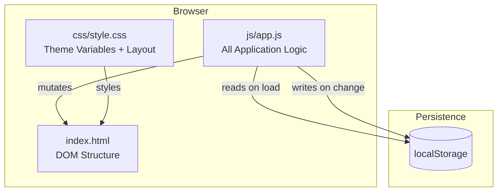
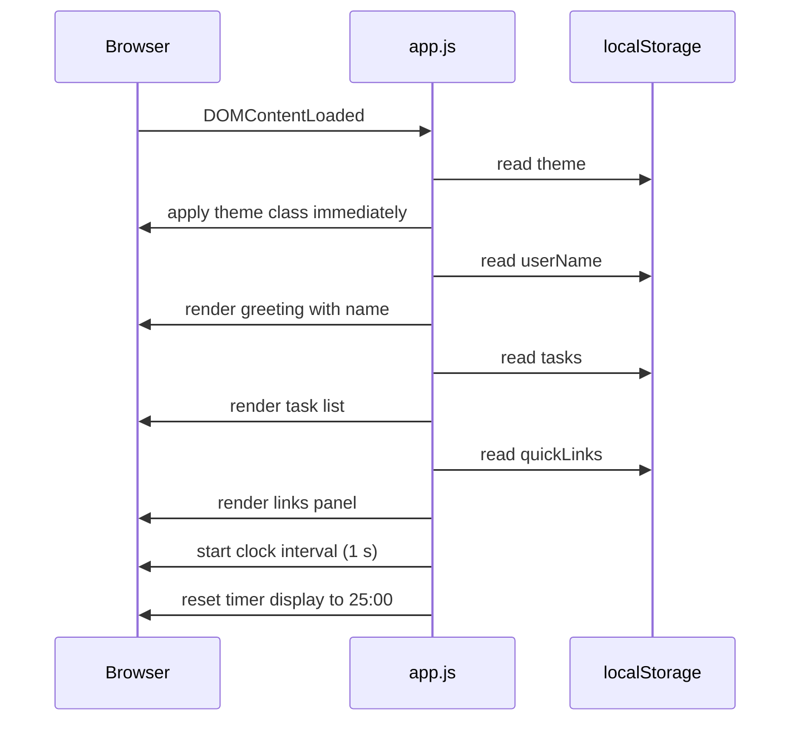

# Design Document — To-Do List Life Dashboard

## Overview

The To-Do List Life Dashboard is a single-page, client-side web application delivered as three files:
`index.html`, `css/style.css`, and `js/app.js`. There is no build step, no framework, and no backend.
The user opens `index.html` directly in a browser and all state persists in the browser's `localStorage`.

The page is divided into four independent widget sections rendered in a responsive grid:

| Widget | Purpose |
|---|---|
| **Greeting** | Live clock, date, time-based greeting, custom name |
| **Timer** | Pomodoro countdown with Start / Stop / Reset |
| **Todo** | Add, edit, complete, delete tasks with duplicate prevention |
| **Links** | Save and open favourite URLs with one click |

Optional enhancements included in scope: light/dark theme toggle, custom name in greeting, and duplicate task prevention.

---

## Architecture

The application follows a **plain-MVC pattern without a framework**:

- **Model** — plain JavaScript objects and arrays kept in memory; synced to `localStorage` on every mutation.
- **View** — DOM manipulation functions that re-render the relevant widget section from the current model state.
- **Controller** — event listeners wired up in `app.js` that call model-mutation functions and trigger view updates.

There is no reactive data binding. Each user action follows a strict cycle:

```
User Action → Controller → Mutate Model → Persist to localStorage → Re-render View
```

Because the project requires a single `app.js` file, all code is grouped into clearly labelled sections (IIFE-like comment blocks) to maintain readability without requiring ES modules or a bundler.



### Initialisation Sequence



---

## Components and Interfaces

### 1. Clock / Greeting Component

**Responsibilities:**
- Display current time (HH:MM:SS), updating every second via `setInterval`.
- Display current date in human-readable format.
- Compute and display time-based greeting ("Good Morning / Afternoon / Evening").
- Append custom user name to greeting if one is saved.

**Key DOM elements:**

| Element ID | Purpose |
|---|---|
| `#clock` | HH:MM:SS time display |
| `#date` | Human-readable date |
| `#greeting` | Greeting text including name |
| `#name-input` | Text input for custom name |
| `#name-save` | Button to save/clear custom name |

**Functions (in `app.js`):**

```
updateClock()         — reads Date(), formats, writes to #clock, #date, #greeting
getGreeting(hour)     — pure: returns "Good Morning/Afternoon/Evening" string
formatTime(date)      — pure: returns "HH:MM:SS" string
formatDate(date)      — pure: returns "Weekday, DD Month YYYY" string
saveName()            — reads #name-input, persists to localStorage, calls updateClock()
loadName()            — reads localStorage.userName, sets #name-input value
```

The clock interval is stored in a module-scoped variable so it can be cleared if needed.

---

### 2. Timer Component

**Responsibilities:**
- Maintain a countdown from a configurable start (default 25:00).
- Expose Start, Stop, Reset controls.
- Notify the user when the countdown reaches zero.
- Disable controls appropriately to prevent invalid states.

**Key DOM elements:**

| Element ID | Purpose |
|---|---|
| `#timer-display` | MM:SS countdown |
| `#timer-start` | Start button |
| `#timer-stop` | Stop button |
| `#timer-reset` | Reset button |

**State variables (module-scoped):**

```javascript
let timerInterval = null;   // setInterval handle or null when stopped
let timerSeconds = 1500;    // current remaining seconds (25 * 60 default)
```

**Functions:**

```
startTimer()    — guards against duplicate intervals; sets timerInterval
stopTimer()     — clears timerInterval; updates button disabled states
resetTimer()    — calls stopTimer(); resets timerSeconds to 1500; updates display
tickTimer()     — called each second: decrements timerSeconds, updates display, checks for zero
formatTimer(s)  — pure: converts seconds to "MM:SS" string
updateTimerButtons(running) — sets disabled attribute on Start/Stop controls
```

---

### 3. Todo Component

**Responsibilities:**
- Add tasks (with duplicate detection and whitespace validation).
- Edit task text inline.
- Toggle completion state.
- Delete tasks.
- Persist the full task list to `localStorage` after every mutation.
- Re-render the task list from the in-memory array after every mutation.

**Key DOM elements:**

| Element ID | Purpose |
|---|---|
| `#todo-input` | New task text input |
| `#todo-add` | Add task button |
| `#todo-list` | `<ul>` container for task items |
| `#duplicate-warning` | Warning message shown on duplicate submission |

Each rendered task item is a `<li>` with a unique `data-id` attribute containing the task's UUID.

**Functions:**

```
addTask()               — validates input, checks duplicates, creates task object, persists, re-renders
deleteTask(id)          — removes task by id from array, persists, re-renders
toggleTask(id)          — flips task.done, persists, re-renders
startEditTask(id)       — swaps text display for an <input> pre-filled with task text
saveEditTask(id, text)  — validates, updates task.text, persists, re-renders
isDuplicate(text)       — pure: checks trimmed case-insensitive match against current tasks array
renderTasks()           — rebuilds #todo-list innerHTML from tasks array
persistTasks()          — JSON.stringify(tasks) → localStorage.tasks
loadTasks()             — JSON.parse(localStorage.tasks) → tasks array; falls back to []
```

---

### 4. Links Component

**Responsibilities:**
- Accept a label and URL, validate both are non-empty, add the link.
- Render each link as a clickable button/anchor opening in a new tab.
- Allow deletion of individual links.
- Persist the full links list to `localStorage` after every mutation.

**Key DOM elements:**

| Element ID | Purpose |
|---|---|
| `#link-label` | Text input for link display label |
| `#link-url` | Text input for URL |
| `#link-add` | Add link button |
| `#links-list` | Container for rendered link buttons |

**Functions:**

```
addLink()           — validates label + URL, creates link object, persists, re-renders
deleteLink(id)      — removes link by id, persists, re-renders
renderLinks()       — rebuilds #links-list from links array
persistLinks()      — JSON.stringify(links) → localStorage.quickLinks
loadLinks()         — JSON.parse(localStorage.quickLinks) → links array; falls back to []
```

---

### 5. Theme Component

**Responsibilities:**
- Toggle between `"light"` and `"dark"` themes.
- Apply theme by toggling a `data-theme="dark"` attribute on `<html>`.
- Persist theme choice.
- Apply saved theme synchronously on page load (before paint) to prevent flash.

**Key DOM elements:**

| Element ID | Purpose |
|---|---|
| `#theme-toggle` | Button/checkbox to switch theme |

**Functions:**

```
applyTheme(theme)   — sets document.documentElement.dataset.theme; updates toggle UI
toggleTheme()       — reads current theme, flips it, calls applyTheme(), persists
loadTheme()         — reads localStorage.theme, calls applyTheme(); defaults to "light"
```

`loadTheme()` is called at the very top of the `DOMContentLoaded` handler (before any other rendering) to ensure the correct theme class is applied before the browser paints.

---

## Data Models

All data is stored in `localStorage` as JSON strings. The application reads on load and writes on every mutation.

### localStorage Keys

| Key | Type | Default |
|---|---|---|
| `tasks` | `Task[]` serialised as JSON | `[]` |
| `quickLinks` | `Link[]` serialised as JSON | `[]` |
| `userName` | `string` | `""` (key absent = no name) |
| `theme` | `"light" \| "dark"` | `"light"` (key absent = light) |

---

### Task Object

```javascript
{
  id:   string,   // crypto.randomUUID() or Date.now().toString() fallback
  text: string,   // trimmed task description
  done: boolean   // false = incomplete, true = complete
}
```

**Example:**
```json
[
  { "id": "a1b2c3", "text": "Buy groceries", "done": false },
  { "id": "d4e5f6", "text": "Read chapter 3", "done": true }
]
```

---

### Link Object

```javascript
{
  id:    string,  // crypto.randomUUID() or Date.now().toString() fallback
  label: string,  // trimmed display label
  url:   string   // URL as entered (normalised to include protocol where missing)
}
```

**Example:**
```json
[
  { "id": "x1y2z3", "label": "GitHub", "url": "https://github.com" },
  { "id": "p9q8r7", "label": "MDN Docs", "url": "https://developer.mozilla.org" }
]
```

---

### CSS Custom Properties (Theme Variables)

The theme system uses CSS custom properties on `:root` / `[data-theme="dark"]` to drive all colours. Switching the `data-theme` attribute on `<html>` is enough to change the entire palette without touching inline styles.

```css
:root {
  --bg-primary:    #ffffff;
  --bg-secondary:  #f5f5f5;
  --text-primary:  #1a1a1a;
  --text-muted:    #666666;
  --accent:        #4a90d9;
  --border:        #e0e0e0;
  --shadow:        rgba(0, 0, 0, 0.08);
  --done-opacity:  0.45;
}

[data-theme="dark"] {
  --bg-primary:    #1e1e2e;
  --bg-secondary:  #2a2a3e;
  --text-primary:  #cdd6f4;
  --text-muted:    #a6adc8;
  --accent:        #89b4fa;
  --border:        #3a3a5a;
  --shadow:        rgba(0, 0, 0, 0.30);
  --done-opacity:  0.40;
}
```

---

### HTML Skeleton

```html
<!DOCTYPE html>
<html lang="en" data-theme="light">
<head>
  <meta charset="UTF-8" />
  <meta name="viewport" content="width=device-width, initial-scale=1.0" />
  <title>Life Dashboard</title>
  <link rel="stylesheet" href="css/style.css" />
</head>
<body>

  <!-- Theme toggle (top-right) -->
  <button id="theme-toggle" aria-label="Toggle dark mode">🌙</button>

  <main class="dashboard-grid">

    <!-- Widget 1: Greeting -->
    <section class="widget" id="widget-greeting">
      <p id="date"></p>
      <h1 id="clock"></h1>
      <h2 id="greeting"></h2>
      <div class="name-row">
        <input id="name-input" type="text" placeholder="Enter your name…" />
        <button id="name-save">Save</button>
      </div>
    </section>

    <!-- Widget 2: Pomodoro Timer -->
    <section class="widget" id="widget-timer">
      <h2 class="widget-title">Focus Timer</h2>
      <div id="timer-display">25:00</div>
      <div class="timer-controls">
        <button id="timer-start">Start</button>
        <button id="timer-stop" disabled>Stop</button>
        <button id="timer-reset">Reset</button>
      </div>
    </section>

    <!-- Widget 3: To-Do List -->
    <section class="widget" id="widget-todo">
      <h2 class="widget-title">To-Do</h2>
      <div class="todo-input-row">
        <input id="todo-input" type="text" placeholder="Add a task…" />
        <button id="todo-add">Add</button>
      </div>
      <p id="duplicate-warning" class="warning hidden"></p>
      <ul id="todo-list"></ul>
    </section>

    <!-- Widget 4: Quick Links -->
    <section class="widget" id="widget-links">
      <h2 class="widget-title">Quick Links</h2>
      <div class="links-input-row">
        <input id="link-label" type="text" placeholder="Label…" />
        <input id="link-url" type="url" placeholder="https://…" />
        <button id="link-add">Add</button>
      </div>
      <div id="links-list"></div>
    </section>

  </main>

  <script src="js/app.js"></script>
</body>
</html>
```

---

### JavaScript File Organisation (`app.js`)

```javascript
// ============================================================
// SECTION 1 — STATE
// ============================================================
// Module-scoped variables: tasks[], links[], timerSeconds,
// timerInterval, clockInterval

// ============================================================
// SECTION 2 — UTILITIES
// ============================================================
// generateId(), padTwo(), formatTime(), formatDate(),
// formatTimer(), getGreeting()

// ============================================================
// SECTION 3 — LOCAL STORAGE
// ============================================================
// loadTasks(), persistTasks()
// loadLinks(), persistLinks()
// loadUserName(), persistUserName()
// loadTheme(), persistTheme()

// ============================================================
// SECTION 4 — THEME
// ============================================================
// applyTheme(theme), toggleTheme()

// ============================================================
// SECTION 5 — CLOCK / GREETING
// ============================================================
// updateClock(), startClock(), saveName()

// ============================================================
// SECTION 6 — TIMER
// ============================================================
// tickTimer(), startTimer(), stopTimer(), resetTimer(),
// updateTimerButtons(running), renderTimerDisplay()

// ============================================================
// SECTION 7 — TO-DO LIST
// ============================================================
// renderTasks(), addTask(), deleteTask(id), toggleTask(id),
// startEditTask(id), saveEditTask(id, text), isDuplicate(text)

// ============================================================
// SECTION 8 — QUICK LINKS
// ============================================================
// renderLinks(), addLink(), deleteLink(id)

// ============================================================
// SECTION 9 — EVENT WIRING
// ============================================================
// All addEventListener() calls

// ============================================================
// SECTION 10 — INIT
// ============================================================
// DOMContentLoaded handler: calls load* functions, startClock(),
// renderTasks(), renderLinks(), wires all events
```

---

## Correctness Properties

*A property is a characteristic or behavior that should hold true across all valid executions of a system — essentially, a formal statement about what the system should do. Properties serve as the bridge between human-readable specifications and machine-verifiable correctness guarantees.*

### Property 1: Valid task addition grows the list

*For any* task list state and any non-empty, non-whitespace task text that is not already present in the list, calling `addTask()` with that text should result in the task list length increasing by exactly one, and the new task's text should match the trimmed input.

**Validates: Requirements 5.2**

---

### Property 2: Whitespace-only task is rejected

*For any* string composed entirely of whitespace characters (spaces, tabs, newlines), submitting it as a new task should leave the task list completely unchanged — length stays the same, no new entry appears.

**Validates: Requirements 5.3**

---

### Property 3: Task persistence round-trip

*For any* task list (including empty, single-item, and multi-item lists), serialising it to `localStorage` via `persistTasks()` and then loading it back via `loadTasks()` should produce a task array that is deeply equal to the original — preserving `id`, `text`, and `done` for every item.

**Validates: Requirements 5.5, 5.6, 7.4, 8.3, 13.2**

---

### Property 4: Duplicate task is rejected

*For any* task list containing at least one task and any candidate text whose trimmed, case-insensitive form matches any existing task's trimmed, case-insensitive text, calling `addTask()` with that candidate should leave the task list completely unchanged.

**Validates: Requirements 9.1**

---

### Property 5: Task completion toggle is its own inverse

*For any* boolean completion state, toggling it twice returns the original value — i.e., `toggle(toggle(done)) === done`. Applied to any task in the list, two consecutive toggle operations are a no-op.

**Validates: Requirements 7.3**

---

### Property 6: Task deletion removes exactly one item

*For any* task list containing a task with a given `id`, calling `deleteTask(id)` should reduce the list length by exactly one and should leave no task with that `id` anywhere in the resulting list, while all other tasks remain present and unchanged.

**Validates: Requirements 8.2**

---

### Property 7: Task edit outcome depends on text validity

*For any* task and any candidate edit text:
- If the trimmed candidate text is non-empty, calling `saveEditTask(id, text)` should update that task's `text` to the trimmed candidate while leaving all other tasks unchanged.
- If the trimmed candidate text is empty or whitespace-only, calling `saveEditTask(id, text)` should leave the task's `text` unchanged.

**Validates: Requirements 6.3, 6.4**

---

### Property 8: Valid link addition grows the links list

*For any* links list state and any link where both the label and the URL are non-empty after trimming, calling `addLink()` should increase the links list length by exactly one, and the new entry should contain the supplied label and URL.

**Validates: Requirements 10.2**

---

### Property 9: Empty label or URL prevents link addition

*For any* link submission where the label is empty/whitespace, or the URL is empty/whitespace (or both), calling `addLink()` should leave the links list completely unchanged.

**Validates: Requirements 10.4**

---

### Property 10: Links persistence round-trip

*For any* links list (including empty, single-item, and multi-item lists), serialising it to `localStorage` via `persistLinks()` and then loading it back via `loadLinks()` should produce a links array that is deeply equal to the original — preserving `id`, `label`, and `url` for every item.

**Validates: Requirements 10.5, 10.6, 11.3, 13.2**

---

### Property 11: Time-based greeting covers all hours

*For any* integer hour in [0, 23], `getGreeting(hour)` should return exactly one of `"Good Morning"`, `"Good Afternoon"`, or `"Good Evening"` — never an empty string and never an unexpected value. Specifically: hours 5–11 → "Good Morning", hours 12–17 → "Good Afternoon", all other hours (18–23, 0–4) → "Good Evening".

**Validates: Requirements 2.1, 2.2, 2.3**

---

### Property 12: Theme toggle is its own inverse

*For any* starting theme value (`"light"` or `"dark"`), calling `toggleTheme()` twice should restore the `data-theme` attribute on `document.documentElement` and the value in `localStorage` back to the original theme value.

**Validates: Requirements 12.2, 12.3**

---

### Property 13: Corrupt localStorage data returns empty default without throwing

*For any* string that is not valid JSON (i.e., `JSON.parse` throws on it), storing that string under `localStorage.tasks` or `localStorage.quickLinks` and then calling `loadTasks()` or `loadLinks()` respectively should return an empty array `[]` and should not throw any unhandled error.

**Validates: Requirements 13.4**

---

## Error Handling

| Scenario | Behaviour |
|---|---|
| `localStorage` unavailable (private mode / quota) | `try/catch` around every read and write; silent fallback to in-memory state only; no unhandled error thrown |
| `localStorage` value is corrupt JSON | `JSON.parse` wrapped in `try/catch`; returns `[]` / `""` / `"light"` as default |
| `crypto.randomUUID` unavailable (old Safari) | Fallback to `Date.now().toString() + Math.random().toString(36).slice(2)` |
| User submits empty task | Input stays focused; no list mutation; warning shown for duplicates |
| User submits duplicate task | Task not added; `#duplicate-warning` shown; input field keeps the submitted text |
| Timer reaches 00:00 | `clearInterval`; `window.alert()` fired; Start re-enabled, Stop disabled |
| Link URL missing protocol | `addLink()` prepends `"https://"` if the URL does not start with `http://` or `https://` |

---

## Testing Strategy

This feature uses a **dual testing approach**: example-based unit tests for specific behaviours and property-based tests for universal correctness properties.

### Unit Tests (example-based)

Target the pure utility and logic functions directly, using concrete input/output pairs:

- `getGreeting(hour)` — test boundary hours (5, 12, 18, 0, 4, 11, 17, 23)
- `formatTime(date)` — known Date object → expected "HH:MM:SS" string
- `formatDate(date)` — known Date object → expected readable date string
- `formatTimer(seconds)` — 1500 → "25:00", 0 → "00:00", 61 → "01:01"
- `isDuplicate(text)` — case/whitespace variants against a fixed task list
- Error handling: corrupt `localStorage` values return defaults without throwing
- Theme: `applyTheme("dark")` sets `document.documentElement.dataset.theme === "dark"`

### Property-Based Tests

Use a PBT library such as [fast-check](https://github.com/dubzzz/fast-check) (loaded via CDN `<script>` tag in the test harness, not in the production page). Each property below should run a **minimum of 100 iterations**.

Each test must include a comment tag in the format:
`// Feature: todo-life-dashboard, Property N: <property text>`

| Property | Generator | Assertion |
|---|---|---|
| **P1** Valid task grows list | `fc.string().filter(s => s.trim().length > 0)` + task array with no matching entry | `tasks.length === original + 1`; new task text equals trimmed input |
| **P2** Whitespace rejected | `fc.string().map(s => s.replace(/\S/g, ' '))` | `tasks` array unchanged (deep equal) |
| **P3** Task round-trip | `fc.array(fc.record({id: fc.string(), text: fc.string(), done: fc.boolean()}))` | Deep equality after `persistTasks()` → `loadTasks()` |
| **P4** Duplicate rejected | Any task array + duplicate text (same/different case/trim) | `tasks` array unchanged |
| **P5** Toggle inverse | `fc.boolean()` | `toggle(toggle(x)) === x` |
| **P6** Delete removes one | Task array with ≥1 item + valid `id` | Length − 1; `id` absent in result; all others intact |
| **P7** Edit outcome by validity | Task + `fc.string()` for new text | Non-whitespace → text updated; whitespace-only → text unchanged |
| **P8** Valid link grows list | `fc.record({label: fc.string().filter(s=>s.trim()!==''), url: fc.string().filter(s=>s.trim()!=='')})` | `links.length === original + 1`; entry contains label and URL |
| **P9** Empty label/URL rejected | Link with empty label or empty URL (or both) | `links` array unchanged |
| **P10** Links round-trip | `fc.array(fc.record({id: fc.string(), label: fc.string(), url: fc.string()}))` | Deep equality after `persistLinks()` → `loadLinks()` |
| **P11** Greeting covers all hours | `fc.integer({min: 0, max: 23})` | Result is one of exactly the three valid greeting strings |
| **P12** Theme toggle inverse | `fc.constantFrom("light", "dark")` | Double-toggle restores original theme in DOM and `localStorage` |
| **P13** Corrupt data fallback | `fc.string().filter(s => { try { JSON.parse(s); return false; } catch { return true; } })` | `loadTasks()` / `loadLinks()` returns `[]` without throwing |

### Test Harness Note

Because there is no build tool, the property-based test file (`tests/pbt.js`) is loaded as a standard `<script>` in a separate `tests/index.html` harness file. This file is not part of the production deployment — it is a development-only artefact.
